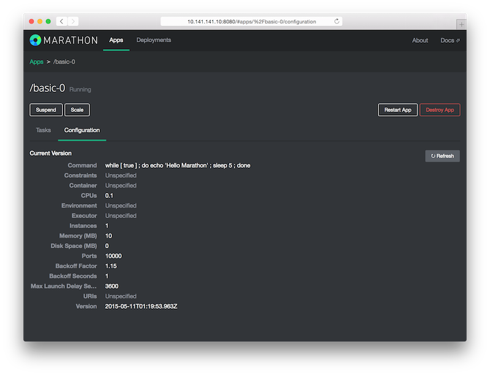
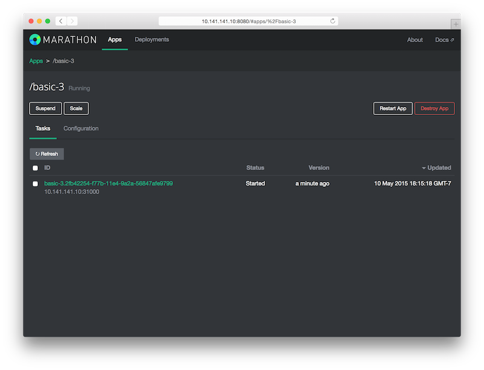
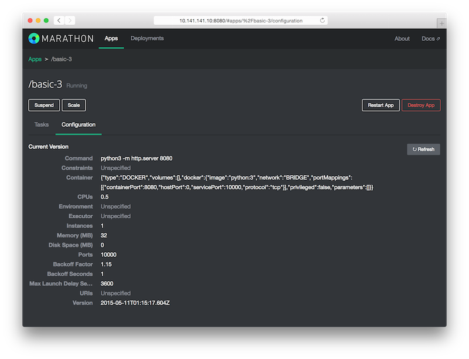

# Marathon 手册
    文档信息
    创建人 庞铮
    邮件地址 zpang@dataman-inc.com
    建立时间 2015年8月12号
    更新时间 2015年8月12号
## 1 基础应用
在 Marathon 里，应用程序是一个完成的概念。每个应用程序通常代表着一个长期运行的服务，其中大部分实例还运行在多台主机上运行。
### 1.1 Hello Marathon:一个内嵌 Shell 脚本
让我们开始一个简单的例子:一个应用程序打印`hello marathon`到`stdout`然后`sleeps 5`秒，无限循环。你可以使用下面的文本定义( JSON 格式 )来描述该应用:

    {
    "id": "basic-0", 
    "cmd": "while [ true ] ; do echo 'Hello Marathon' ; sleep 5 ; done",
    "cpus": 0.1,
    "mem": 10.0,
    "instances": 1
    }
请注意,上面例子中的 `cmd`是一个可执行命令。它通过 Mesos executor 通过`/bin/sh -c ${cmd}`来执行。所有执行的任务都是 Marathon 通过 Mesos 执行器进行。 Mesos 执行器的每一个任务都执行在自己的沙河环境中。沙盒是一个特殊的目录(容器)，每一个执行器环境的 slave (从存储的角度)都包含相关的相关的日志文件以及执行命令的`stderr`和`stdout`。沙盒利用日志担当了调试分布式应用程式的角色。[参考](http://open.mesosphere.com/intro-course/ex19.html) 

### 1.2 应用的资源分配
不管运行什么样的应用，不管有多小，通常都要依赖一个资源集合，即文件和或者文件档案。 Marathon 使用 URL 的概念来处理这个问题。它利用了从目标下载来提取所需要的资源。但深入这个话题之前，我们先来看一看例子：
    
    {
    "id": "basic-1", 
    "cmd": "./cool-script.sh",
    "cpus": 0.1,
    "mem": 10.0,
    "instances": 1,
    "uris": [
        "https://example.com/app/cool-script.sh"
    ]
    }
上面的例子中，执行命令之前，会先通过 Mesos 下载`https://example.com/app/cool-script.sh`到沙盒中，使其可以运行。你可以使用 Mesos UI 和 点击进入 Mesos 工作节点的沙盒，应该可以找到`cool-script.sh`。

请注意，在 Mesos0.22上下载代码后是不可执行的，所以 CMD 应该是:
    
    chmod u+x cool-script.sh && ./cool-script.sh
正如上面提到的， Marathon知道如何处理在档案中的应用资源。目前， Marathon 将(通过 Mesos 在执行器之前执行`cmd`命令)第一次尝试解压/提取下列文件扩展名的资源:
    
    .tgz
    .tar.gz
    .tbz2
    .tar.bz2
    .txz
    .tar.xz
    .zip
下面的例子表示你如何在实际场景执行压缩格式,假设你要使用一个可执行脚本`cool-script.sh`压缩在`https://example.com/app.zip`包中，你想执行它:
    
    {
    "id": "basic-2", 
    "cmd": "app/cool-script.sh",
    "cpus": 0.1,
    "mem": 10.0,
    "instances": 1,
    "uris": [
        "https://example.com/app.zip"
    ]
    }
请注意，对比 basic-1 的例子,现在的命令是`app/cool-script.sh`。实际上，当`zip`文件被下载并解压缩后，解压缩程序会根据`app.zip`创建出和`zip`文件名一样的目录。当然你还可以指定多种资源而不光是一种，比如下面例子中的 GIT 仓库 以及 一些 CDN 资源:
    
    {
    ...
    "uris": [
        "https://git.example.com/repo-app.zip", "https://cdn.example.net/my-file.jpg", "https://cdn.example.net/my-other-file.css"
    ]
    ...
    }
通过URL下载的应用程序二进制，你可以自动构建一个典型的开发部署周期模式。[URI方案](http://tools.ietf.org/html/rfc3986#section-3.1)还支持:
    
- file:
- http:
- https:
- ftp:
- ftps:
- hdfs:
- s3:    
    
### 1.3 一个简单的 Docker 基础应用
Marathon 可以直接运行使用 Docker images。相信参考[ Marathon 上运行的 Docker 容器](https://mesosphere.github.io/marathon/docs/native-docker.html)来进一步了解细节和高级选项。在下面的应用程序示范中，我们将专注于一个简单的 Docker 应用：使用基于 Docker image python:3 的镜像发布 Python-based web 服务。在容器中 web 服务的端口运行在 8080 中(containerPort的值)。在容器外面，Marathon会随机生成一个端口给它使用(hostPort值设置成0):

    {
      "id": "basic-3",
      "cmd": "python3 -m http.server 8080",
      "cpus": 0.5,
      "mem": 32.0,
      "container": {
        "type": "DOCKER",
        "docker": {
          "image": "python:3",
          "network": "BRIDGE",
          "portMappings": [
            { "containerPort": 8080, "hostPort": 0 }
          ]
        }
      }
    }
 Marathon 上的 UI 目前不支持直接发布 Docker 应用，所以我们使用 Marathon 提供的 [HTTP API](https://mesosphere.github.io/marathon/docs/rest-api.html) 来部署 basic-3 服务:
     
     curl -X POST http://10.141.141.10:8080/v2/apps -d @basic-3.json -H "Content-type: application/json"
假设你将上面的内容黏贴到了一个 JSON 的文件中，名为`basic-3.json`并运行上面的命令发布到 Mesos 中。测试从 Marathon 部署一个基于 Mesos 沙盒环境的基础服务。当你完成了上述操作，你就可以从 Marathon UI 看到分配的任务和标签。

这个练习结果是， Marathon 已经部署了一个基于 Docker 容器的 web 服务器，现在这个 HTTP 服务的跟目录内容可以通过`http://10.141.141.10:31000`访问。
## 2 服务发现和负载均衡
一旦我们发布了应用程序，我们就需要一种方式将他的流量发布到外网。如果我们运行了很多的应用程序，他们还需要一种方法找到对方。我们可以通过使用 [Mesos-DNS](https://github.com/mesosphere/mesos-dns) 域名系统来做服务发现([DNS](https://en.wikipedia.org/wiki/Domain_Name_System))。

使用 Mesos-DNS 为每个运行在 Mesos 的应用程序生成一个`hostname`并将这些`hostname`转换成当前运行程序使用的 IP 地址和端口.如果使用的应用程序通过多个框架(而不只是 Marathon )特别有用。检查 [Mesos-DNS 文档和教程页面](http://mesosphere.github.io/mesos-dns/)进一步获取信息。

服务发现的另一种方法是在集群中的每一个主机上运行一个 TCP 代理，并对在主机上运行的应用透明的映射到本地的一个静态端口。 这样客户端只需要连接该端口就可以实现网络细节的完全抽象。所有应用程序都通过 Marathon 来启动。
### 2.1 端口分配
当 Marathon 创建了一个应用(或通过 REST API 或通过 UI )，你可以指定一个或者多个端口。这些端口可以是任何的有效端口号或者 0 ，如果是 0 Marathon 将使用随机分配的一个端口号。这些端口是用来没有任何应用程序的端口会被 Marathon 重叠分配。(即该端口是全局唯一的).

由于多个实例可以在同一个节点上运行，每个实例(或任务)被分配一个随机的端口。每个被分配的端口都不是绑定在应用上的，而是由 Marathon 通过 $POST 变量设置的。每个运行的任务端口信息可以通过 [Marathon 的 API](https://mesosphere.github.io/marathon/docs/rest-api.html#get-/v2/tasks) 端查询:`<marathon host>:<port>/v2/tasks`
### 2.2 使用 HAPROXY
因为官方手册使用脚本方式获取信息，与数人使用bamboo类似，所以暂时不与翻译。
## 3 SSL 和 HTTP 基本认证
Marathon 可以通过 SSL 和 HTTP 基本认证与访问控制来限制 API 的访问。如果你计划使用基本身份验证，我们建议启用 SSL ，否则用户名和密码发送将未加密，这样会导致非常容易被破解。
### 3.1 启用 SSL
如果你已经有了一个 JAVA keystore，通过启动参数打开 Marathon 的 SSL:

    $ cd /path/to/marathon
    $ ./bin/start --master zk://localhost:2181/mesos \
                  --zk zk://localhost:2181/marathon \
       --ssl_keystore_path marathon.jks \
       --ssl_keystore_password $MARATHON_JKS_PASSWORD
默认情况下， Marathon 服务器响应 SSL 请求端口都会开放在`8443`(可以使用`--https_port`[参数](https://mesosphere.github.io/marathon/docs/command-line-flags.html)进行修改)。通过参数重启 Marathon 就可以通过 HTTPS 访问它的 API 和 UI:

    $ curl https://localhost:8443/v2/apps
### 3.2 生成一个 SSL 密钥以及证书
警告:现代游览器和大多数工具都会给用户一个警告，使其很难进入 Marathon 的 API 和 UI 除非你的 SSL 证书是由受信的证书机构颁发的。无论是从一个权威机构购买一个证书还是将生成的根证书发给用户。

#### 3.2.1 生成一个 OpenSSL 的 RSA 私钥
    # Set key password to env variable `MARATHON_KEY_PASSWORD`
    $ openssl genrsa -des3 -out marathon.key -passout "env:MARATHON_KEY_PASSWORD"

#### 3.2.2 获得密钥证书的方法
- (推荐)从受信任的证书机构购买证书。这将确保 Marathon 实例的 API 和 UI的用户客户端已经信任此证书，防止用户有额外步骤。
- (不可信)生产的汨要证书。这个命令提示信息安全密钥。如果你打算使用它，`Common Name`必须完全限定于`hostname`.

        # Read key password from env env variable `MARATHON_KEY_PASSWORD`
        $ openssl req -new -x509 -key marathon.key \
               -passin "env:MARATHON_KEY_PASSWORD" \
               -out self-signed-marathon.pem`
#### 3.2.3 将密钥和证书文件导入到一个 PKCS12 格式的文件中，格式化使用 Java keystore。如果你收到的证书不是 PEM 格式，请查看 [SSL 配置文件如何转换](http://www.eclipse.org/jetty/documentation/current/configuring-ssl.html#loading-keys-and-certificates)。
        # Read key password from env variable `MARATHON_KEY_PASSWORD`
        # Set PKCS password to env variable `MARATHON_PKCS_PASSWORD`
        $ openssl pkcs12 -inkey marathon.key \
                -passin "env:MARATHON_KEY_PASSWORD" \
                -name marathon \
                -in trusted.pem \
                -password "env:MARATHON_PKCS_PASSWORD" \
                -chain -CAFile "trustedCA.crt" \
                -export -out marathon.pkcs12
#### 3.2.4 导入 keystore 文件
        # Read PKCS password from env variable `MARATHON_PKCS_PASSWORD`
        # Set JKS password to env variable `MARATHON_JKS_PASSWORD`
        $ keytool -importkeystore -srckeystore marathon.pkcs12 \
                         -srcalias marathon \
                         -srcstorepass $MARATHON_PKCS_PASSWORD \
                         -srcstoretype PKCS12 \
                         -destkeystore marathon.jks \
                         -deststorepass $MARATHON_JKS_PASSWORD
#### 3.2.5 Marathon 启动参数配置
        # Read JKS password from env variable `MARATHON_JKS_PASSWORD`
        $ ./bin/start --master zk://localhost:2181/mesos \
                  --zk zk://localhost:2181/marathon \
                  --ssl_keystore_path marathon.jks \
                  --ssl_keystore_password $MARATHON_JKS_PASSWORD
#### 3.2.6 通过 HTTPS 端口访问 Marathon API 和 UI(默认8443)
        https://<MARATHON_HOST>:8443
### 3.3 启用基本访问验证
注意: 强烈建议如果你计划使用基本身份验证，请启动 SSL。如果没有启用 SSL , Marathon 会在未加密的情况下传输用户名和密码。很容易就被获取。用户名和密码用冒号(:)分割，启动参数`--http_credentials`命令行表示已经启动了基本身份验证。用户名不能包含冒号.

        $ cd /path/to/marathon
        $ ./bin/start --master zk://localhost:2181/mesos \
                  --zk zk://localhost:2181/marathon \
                  --http_credentials "cptPicard:topSecretPa$$word" \
                  --ssl_keystore_path /path/to/marathon.jks \
                  --ssl_keystore_password $MARATHON_JKS_PASSWORD
## 4 其他
以及下面涉及的内容包括ssl加密以及开发使用虚拟机的问题，暂时用不到。所以下面内容暂时不做翻译。[点击查看后续](https://mesosphere.github.io/marathon/docs/service-discovery-load-balancing.html)
    
    
    
    
    