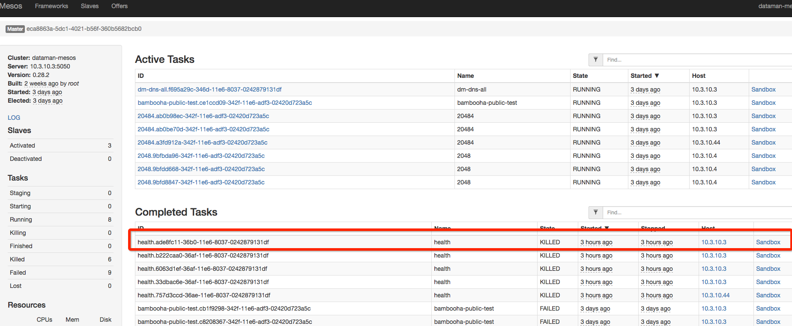
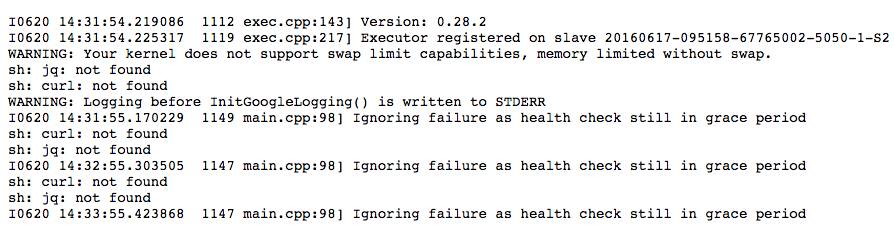

# Marathon Health check 健康检查
对运行中的应用程序，可能需要健康检查。

- 默认的健康检查推迟了 Mesos 已知任务状态，从 `TASK_RUNNING => healthy`
- Marathon 通过[RESTAPI](https://mesosphere.github.io/marathon/docs/rest-api.html)或者[RESTAPI中文](https://github.com/Dataman-Cloud/operation/blob/master/%E8%BF%90%E7%BB%B4%E6%96%87%E6%A1%A3/%E6%8A%80%E6%9C%AF%E6%96%87%E6%A1%A3/marathon/RestApi.md) 来设定一个成员心跳

健康检查通过以下两种情况:

1. HTTP 响应代码为200-399之间
2. 响应超时时间(`timeoutSeconds`).如果任务失败超过最大值(`maxConsecutiveFailures`)，这项任务将被杀。

HTTP 样例

    {
      "path": "/api/health",
      "portIndex": 0,
      "protocol": "HTTP",
      "gracePeriodSeconds": 300,
      "intervalSeconds": 60,
      "timeoutSeconds": 20,
      "maxConsecutiveFailures": 3,
      "ignoreHttp1xx": false,
    }
TCP 样例

    {
      "portIndex": 0,
      "protocol": "TCP",
      "gracePeriodSeconds": 300,
      "intervalSeconds": 60,
      "timeoutSeconds": 20,
      "maxConsecutiveFailures": 0
    }
命令样例

    {
      "protocol": "COMMAND",
      "command": { "value": "curl -f -X GET http://$HOST:$PORT0/health" },
      "gracePeriodSeconds": 300,
      "intervalSeconds": 60,
      "timeoutSeconds": 20,
      "maxConsecutiveFailures": 3
    }
## Health check 参数
### 每一个任务都可设置

- `protocol`(可选值. 默认"HTTP")

    需要执行请求的协议.其中包括 `"HTTP/TCP/COMMAND"`，`HTTP/TCP` 健康检查由 Marathon 执行，所以检查服务需要 Marahon Leader 可以访问到。`"COMMAND"`健康检查由 Mesos 通过代理运行本地执行器执行。

- `gracePeriodSeconds` (可选值. 默认: 300S)
    - 定义1
        
        健康检查失败前几秒中会被忽略,被用作 docker 启动后，服务因加载慢而还没有启动完成的情况。
    - 定义2
        
        首次运行后多久后才会心跳检查
- `intervalSeconds` (可选值. 默认: 60S)

    两次健康检查之间的间隔时间
- `maxConsecutiveFailures`  (可选值. 默认: 3)

    连续健康检查失败几次后，会被系统定义成不健康而被系统 kill 掉。如果这个值为0，那么任务将不会被杀死。
- `timeoutSeconds` (可选值. 默认: 20S)

    定义服务多久没有响应就定义为超时

### 仅 HTTP/TCP 可设置
- `portIndex` (可选值. 默认: 无)

    多端口服务时，健康检查需要使用端口阵列，如果应用使用随机端口,如 `"[0, 0, 0]"`和任务启动时使用端口变凉，如`$PORT1`.
- `port` (可选值. 默认: 无)

    端口用于健康检查

### 仅 HTTP 可设置
- `path` (可选值. 默认: "/")

    那个 HTTP URL 提供任务监控检查。例如:"/path/to/health"
- `ignoreHttp1xx` (可选值. 默认: FALSE)

    忽略 HTTP 信息状态码100-199，如果任务监控检查被返回此信息将被抛弃，任务健康状况不变。

## 健康生命周期
应用程序的监控生命周期由有限状态机代表。如图：

- `i` 请求的实例数
- `r` 运行实例数
- `h` 健康实例数

    

## COMMAND 监控检查注意
因为数人云使用的全部使用的是 Docker 封装 Mesos 组件，包括 Slave。所以如果使用 COMMAND 模式中的命令或者环境需求，Mesos-Slave 不支持，就无法正常使用。因为 Marathon 使用 COMMAND 监控检查是直接使用 Mesos 集群资源并使用 Mesos 自身执行器执行，也就是说，需要 Mesos-slave 本身 Docker 镜像环境支持才可以运行。

