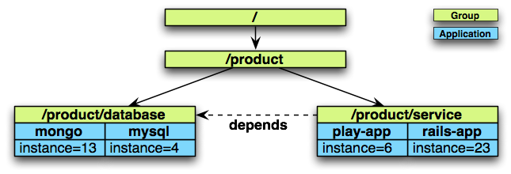

# Marathon 参考
    文档信息
    创建人 庞铮
    邮件地址 zpang@dataman-inc.com
    建立时间 2015年8月12号
    更新时间 2015年8月12号
## 1 应用组
应用程序可以嵌套到一个 n-ary tree中,使用跟随组如分支和应用，如树叶。应用程序组将多个应用程序划分成可管理的组。

这个定义看起来像:
    
    {
      "id": "/product",
      "groups": [
    {
      "id": "/product/database",
      "apps": [
         { "id": "/product/mongo", ... },
         { "id": "/product/mysql", ... }
       ]
    },{
      "id": "/product/service",
      "dependencies": ["/product/database"],
      "apps": [
         { "id": "/product/rails-app", ... },
         { "id": "/product/play-app", ... }
      ]
    }
      ]
    }
### 1.1 依赖关系
应用程序可以有依赖关系。例如:启动的应用程序可能需要数据库来运行，如果在应用程序规范中定义了以来关系， Marathon 就可以知道正确顺序开始按照设定启动、关闭、升级应用程序。

应用等级和应用组等级可以表示依赖关系。如果依赖关系表达是在一个等级组里，这种依赖性会继承传递到这个组合这个组里的所有应用。

依赖关系可以用绝对路径或相对路径表示。如果定义在应用程序组服务中，所有3个定义都具有相同的含义:

    {
      ...
      "dependencies": ["/product/database"],
      "dependencies": ["../database"],
      "dependencies": ["specific/../../database"],
      ...
    }
### 1.2 组缩放
整个组时可以被整个缩放的。所有传递的应用程序的实力数都将发生相应的变化。

    PUT /v2/groups/product HTTP/1.1
    Content-Length: 21
    Host: localhost:8080
    User-Agent: HTTPie/0.7.2
    { "scaleBy": 2 }
每一个应用程序的实例计数在这个操作后都将扩展一倍。
## 2 影存储
暂时不翻译
## 3 启动命令行参数
暂时不翻译
## 4 约束 Constraints
Marathon 可以通过 Constraints 来控制其应用在何处运行和怎么运行,来实现对于程序的优化、容错和资源控制。我们可以通过 Marathon 的 R​EST API ​或者 M​arathon gem (​marathon client) 来设置应用的 Constraints 配置。如果使用 gem 请确保版本要在0.20或者更高。

Constraints 由三个部分组成:

- 字段名 (field name)
- 操作 (operator)
- 可选参数 (optional parameter)

### 4.1 字段
字段名 (field name) 可以为 Mesos 的一个 Slave 的 hostname 或者 Mesos slave 的 attribute。
#### 4.1.1 主机字段 Hostname field
Hostname 字段 hostname 匹配 slave 的 hostnames ,也可以是主机 IP 。 hostname 支持所有的 Marathon operator 操作。例子可以查看 UNIQUE operator 。
 
#### 4.1.2 属性字段 Attribute field
如果 (field name) 是 none ,将被视为使用 Mesos slave 属性。Mesos slave 属性是一个 slave 节点的标记，详细查看 `mesos-slave --help`。


如果slave没有指定的属性标签，那么大部分的操作将会拒绝在这个主机上运行任务。实际上只有  UNLIKE 操作将会被认可操作(而且永远会)，而其他操作将被永远拒绝。

Attribute field 支持所有的 Marathon operator 操作。

### 4.2 操作
#### 4.2.1 UNIQUE 操作
UNIQUE 告诉 Marathon 启动的任务是强制唯一的。

gem：

    $ marathon start -i sleep -C 'sleep 60' -n 3 --constraint hostname:UNIQUE

curl:

    $ curl -X POST -H "Content-type: application/json" localhost:8080/v2/apps -d '{
    "id": "sleep-unique",
    "cmd": "sleep 60",
    "instances": 3,
    "constraints": [["hostname", "UNIQUE"]]
      }'
field name = hostname, operator = UNIQUE, 在每个slave上只起一个instance。
如果申请了 5 个 nginx instance ,而我们 Mesos 集群节点只有 4 个 slave ,那么我们在 Marathon 管理界面上就能看到 剩下的1个 app 为Deploying状态。

#### 4.2.2 CLUSTER 操作
CLUSTER 操作允许应用程序在所有的 Mesos slave 中共享一个特定的属性。这个是非常有用的参数，比如需要特定的硬件需求的应用或者你想运行在同一个机架降低延迟。

gem:

    $ marathon start -i sleep -C 'sleep 60' -n 3 --constraint rack_id:CLUSTER:rack-1

curl:

    $ curl -X POST -H "Content-type: application/json" localhost:8080/v2/apps -d '{
    "id": "sleep-cluster",
    "cmd": "sleep 60",
    "instances": 3,
    "constraints": [["rack_id", "CLUSTER", "rack-1"]]
      }'
你还可以使用此属性来标称应用跑在特殊的配置机器上。
    
    $ curl -X POST -H "Content-type: application/json" localhost:8080/v2/apps -d '{
    "id": "sleep-cluster",
    "cmd": "sleep 60",
    "instances": 3,
    "constraints": [["hostname", "CLUSTER", "a.specific.node.com"]]
      }' 
#### 4.2.3 GROUP_BY 操作
group_by 操作可以用来将任务均匀的发布到机架或者数据中心中实现高可用。

gem:

    $ marathon start -i sleep -C 'sleep 60' -n 3 --constraint rack_id:GROUP_BY
    
curl：
    
    $ curl -X POST -H "Content-type: application/json" localhost:8080/v2/apps -d '{
    "id": "sleep-group-by",
    "cmd": "sleep 60",
    "instances": 3,
    "constraints": [["rack_id", "GROUP_BY"]]
      }'
注意：通过分析当前运行的任务， Marathon 只知道不同的attribute(例如:"rack_id")。如果任务没有正常跨越可能是任何值，它可能需要制定值约束的数量值。例子，如果你要在3个机架:

gem:
    
    $ marathon start -i sleep -C 'sleep 60' -n 3 --constraint rack_id:GROUP_BY:3
    
curl:
    
    $ curl -X POST -H "Content-type: application/json" localhost:8080/v2/apps -d '{
    "id": "sleep-group-by",
    "cmd": "sleep 60",
    "instances": 3,
    "constraints": [["rack_id", "GROUP_BY", "3"]]
      }'
#### 4.2.4 LIKE 操作
LIKE 操作支持正则表达式作为参数，允许你的任务只运行在你的正则规定的范围。

gem:

    $ marathon start -i sleep -C 'sleep 60' -n 3 --constraint rack_id:LIKE:rack-[1-3]
    
curl:
    
    $ curl -X POST -H "Content-type: application/json" localhost:8080/v2/apps -d '{
    "id": "sleep-group-by",
    "cmd": "sleep 60",
    "instances": 3,
    "constraints": [["rack_id", "LIKE", "rack-[1-3]"]]
      }'
注意：该参数是必须的，否则将会得到一个警告。
#### 4.2.5 UNLIKE 操作
这个操作与LIKE相反，允许你的任务只在你的正则规定的范围外运行。

gem:

    $ marathon start -i sleep -C 'sleep 60' -n 3 --constraint rack_id:UNLIKE:rack-[7-9]
    
curl:

    $ curl -X POST -H "Content-type: application/json" localhost:8080/v2/apps -d '{
    "id": "sleep-group-by",
    "cmd": "sleep 60",
    "instances": 3,
    "constraints": [["rack_id", "UNLIKE", "rack-[7-9]"]]
     }'