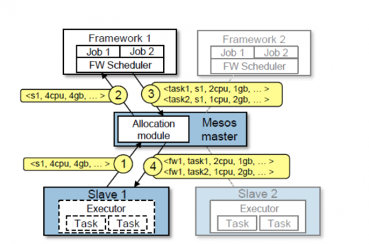
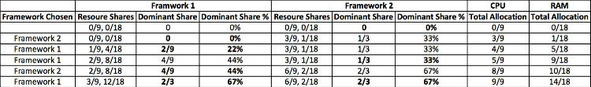

# Mesos 任务调度过程
## 1 官方说明
### 1.1 调度图

### 1.2 步骤
- Slave1 将自己的空闲资源汇报给 Master
- 现在同时有两个调度器同时申请资源
- Master 通过分配模块查看调度器已使用的资源都为空
- Master 将所有空闲资源随机分配了 Framework1
- Framework1 下发了2个任务，2c1g/1c2g
- Framework1 将剩余1c1g资源退回给 Master
- Master 接到了 Framework1 下发的任务在 Slave1 执行器下启动
- Framework1 完成第一次任务下发
- Master 通过分配模块查看 Framework1 已使用的资源高于 Framework2
- Master 将空闲资源下发给 Framework2

## 2 DRF
### 2.1 说明
- 条件

    集群共 9C18G 内存, Framework1 单任务需要（1C4G），Framework2 单任务需要(3C2G)。
- Framework1

    每个任务会消耗CPU总数的1/9、内存总数的2/9,内存主导。
- Framework2

    每个任务会消耗CPU总数的1/3、内存总数的1/18,CPU主导。

### 2.2 下发步骤

## 3 问题
如图可以看出因 Mesos-Master 不关心 Framework 中每个任务的资源申请情况，所以在 DRF 的这个样例中，每次资源申请周期(每个Framework各一次)只能发一个任务,这样就导致了任务下发非常非常缓慢，但这样做会使得多 Framework 同时下发任务时，资源会相对平均分配。根据默认实际测试情况来说，如果有1台超强的机器跑多个任务(比如100个)就会导致每个资源申请周期只能运行1个任务，要循环100次。
## 4 解决
数人云本身使用 marathon 作为唯一的持久化任务调度器，所以为了加速任务发布，按照官方文档修改了`max_tasks_per_offer`参数为1000，这样我们就获得了在每次资源分配周期，如果资源够用，1次同时就可以下发1000个任务而不用管slave的数量有多少。但这种设置的缺点时无法遵循 `DRF`，在多个调度器同时申请资源的时候，如果申请资源都超过了集群本身剩余资源就会导致第一个增加了`max_tasks_per_offer`申请的资源过多而导致无法`DRF`。